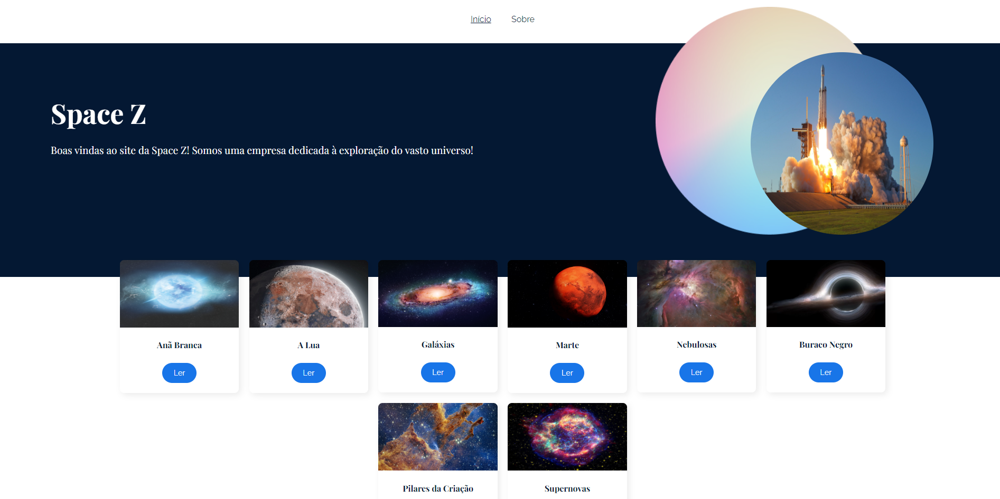
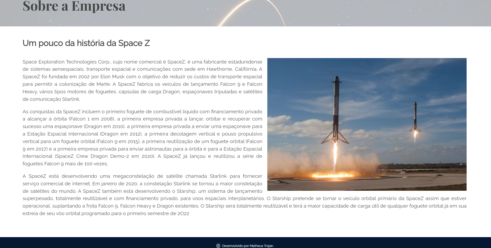
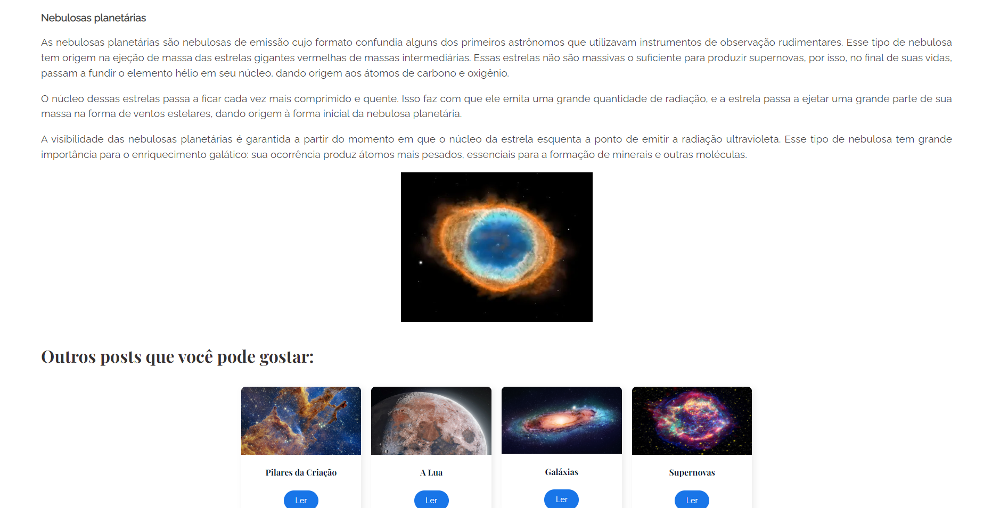
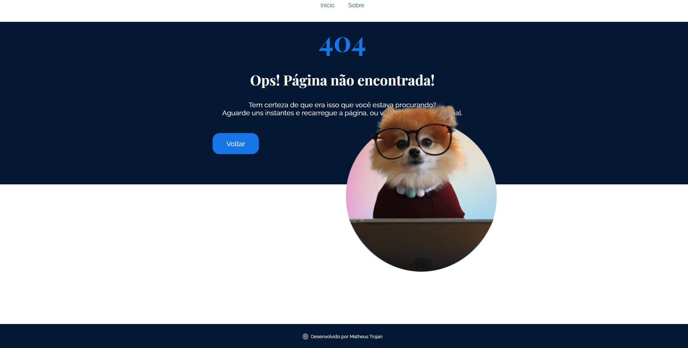

# Site da Empresa Fictícia Space-Z

Página criada acompanhando um curso sobre a utilização do React-Router-Dom e suas funcionalidades

## Conteúdo deste Readme:

- [Resumo](#resumo)
  - [O Desafio](#o-desafio)
  - [Screenshot](#screenshot)
  - [Deploy](#deploy)
- [Meu processo](#meu-processo)
  - [Projetado com](#projetado-com)
  - [O que eu aprendi](#o-que-eu-aprendi)
- [Autores](#autores)

## Resumo

### O Desafio

O site foi criado como uma SPA (Single Page Application) onde o usuário poderá acessar os conteúdos sobre o universo sem precisar recarregar a página. Poderá navegar através dos posts contendo informações e curiosidades sobre diversos elementos do universo.

O usuário deverá conseguir:

- Visualizar todos posts que levam às respectivas páginas;
- Acessar a aba que contém informações sobre a empresa;s
- Navegar pelo site sem a necessidade da mesma ficar recarregando;
- Ser direcionado para uma página informando sobre algum erro no URL (Página não encontrada);
- Acessar outros posts recomendados ao final de cada página;

### Screenshot

#### Imagem da parte inicial do site

#### Imagem da aba "sobre"

#### Imagem do post sobre Nebulosas e os posts recomendados

#### Imagem da aba de página não encontrada

### Deploy

Acesse através deste [link](https://space-z.vercel.app/)

## Processo de Criação

### Projetado com

- React;
- React Router Dom;
- Hooks useLocation, useParams, useNavigate;
- Componentes Reutilizáveis;
- Responsividade para todas telas;

### O que eu aprendi

🟢 Utilização de rotas aninhadas e dinâmicas com o React Router Dom 
🟢 Como funcionam os hooks do react-router-dom 
🟢 O que é e como utilizar uma SPA 
🟢 Importação dinâmica de imagens, fontes e estilos 

## Autor

- [Matheus Trojan](https://www.linkedin.com/in/matheus-trojan/)
